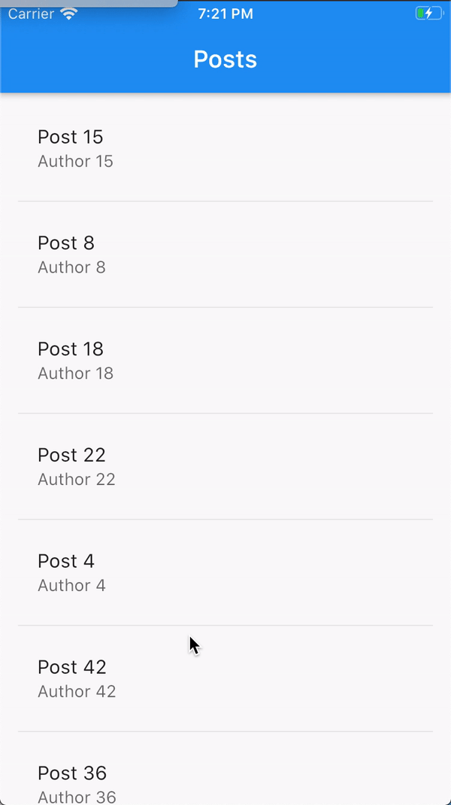

# Lazy loading demo app

A sample Flutter app deonstrating how to lazy load/paginate through data from Firestore in real time (so the data is updated whenever a change occurs).
It's meant to be used with a companion [Medium article](https://medium.com/better-programming/lazy-loading-data-from-firestore-in-real-time-using-flutter-baa4157462fe).

